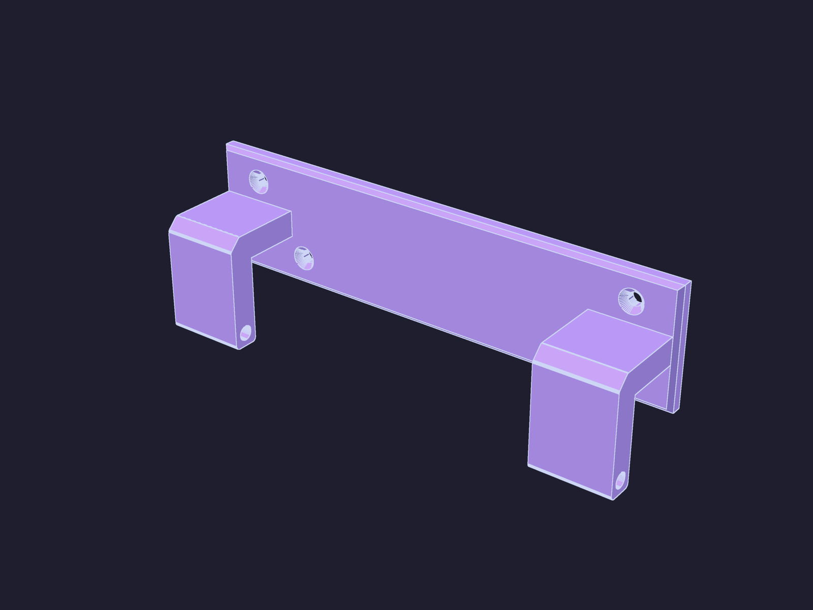

# Caterham Door Hanger — Wall Mount

*A wall-mounted bracket that holds a Caterham door vertically by its bottom
frame member.  The door hangs ~28 mm from the wall in two J-hook cradles.*

Prints as a single piece — one hanger per door.  Print two for a pair.

| | |
| --- | --- |
| **Source** | [`door_hanger.scad`](door_hanger.scad) |
| **STL** | [`door_hanger.stl`](door_hanger.stl) |
| **Material** | PETG (never PLA — UV and creep kill PLA under load) |
| **Screws** | 4× #8 countersunk wood screws (2 above, 2 below arms) |

---

## Dimensions

| Dimension | Value |
|-----------|-------|
| Backplate | 174 × 42 × 5 mm (full rectangle, beveled front edges) |
| Backplate rear (wall side) | Flat — no rounding |
| Arm shape | J-hook with smooth 45° curved corner |
| Arm width | 28 mm |
| Arm thickness | 9.25 mm (cradle Ø + 4 mm, 2 mm each side) |
| Arm spacing (centre–centre) | 142.8 mm |
| Cradle diameter | 5.25 mm |
| Cradle length (through arm) | 28 mm |
| Cradle centre from wall | 30 mm |
| Cradle centre below arm top | 35.4 mm |
| Material below cradle hole | ~2 mm |
| Door–wall gap | ~28 mm |
| Top screw (Y from centre) | +6.86 mm (6.86 mm above arm attachment) |
| Bottom screw (Y from centre) | −16.11 mm (6.86 mm below arm attachment bottom) |
| Backplate front bevel | 1.5 mm, 45° chamfer |
| Arm edge rounding | 1.5 mm radius (via profile offset) |
| Print volume | 174 × 56 × 35 mm |

---

## Printing

| Setting | Value |
|---------|-------|
| **Orientation** | Backplate flat on the bed, arms pointing up (+Z) |
| **Supports** | **None required** |
| **Material** | PETG |
| **Walls** | ≥ 4 |
| **Infill** | 30 % (gyroid or grid) |
| **Layer height** | 0.20 mm |
| **Nozzle** | 0.4 mm |

### Print notes

- Orient the STL so the backplate sits flat on the print bed — the J-hooks
  will point upward with no overhangs needing support.
- PETG is essential — PLA creeps under sustained load.
- ASA works too if you have an enclosure.
- After printing, rotate the hanger 90° about X for wall mounting (the
  backplate faces the wall, arms extend outward).

---

## Mounting

1. **Position the hanger** against the wall at your preferred height. Use a level!
2. **Mark through the 4 mounting holes** — one above and one below each arm.
3. **Drill and plug** for #8 wood screws.
4. **Screw the hanger** to the wall. The countersunk holes let the screw heads
   sit flush with the face.
5. **Repeat** for the second door.
6. **Hang the door** by lowering its bottom frame member into both J-hook
   cradles. The leather trim on the door fits in the 35.4 mm drop below the
   arm attachment.

---

## Design notes

All parameters are at the top of `door_hanger.scad` — change to suit your door.

- **J-hook**: A single 45° diagonal connects the horizontal stem to the
  vertical outer face, creating one smooth curved corner via the 1.5 mm
  offset rounding — no double-curve melding.
- **Uniform arm thickness**: The outer and inner faces of the vertical arm
  are parallel, ensuring consistent 9.25 mm wall thickness throughout the
  J-hook.
- **Backplate**: The rear face (wall side) is flat with sharp corners for a
  flush wall fit.  The front face has a 1.5 mm chamfer all around for a clean
  finish.
- **Screw placement**: The top screws are 6.86 mm above the arm attachment
  line; the bottom screws are 6.86 mm below the arm attachment bottom.
  Margins above the top countersink and below the bottom countersink are
  equal (~5.4 mm).
- **Cradle**: The Ø5.25 mm through-hole runs across the full 28 mm arm width.
  Only ~2 mm of material sits below the hole bottom.
- **Parametric**: Adjust `drop`, `arm_l`, `arm_t`, `hook_gap`, and more at
  the top of the SCAD file for different door dimensions.

---

## License

CC BY-NC 4.0 — see [LICENSE](../../LICENSE).
