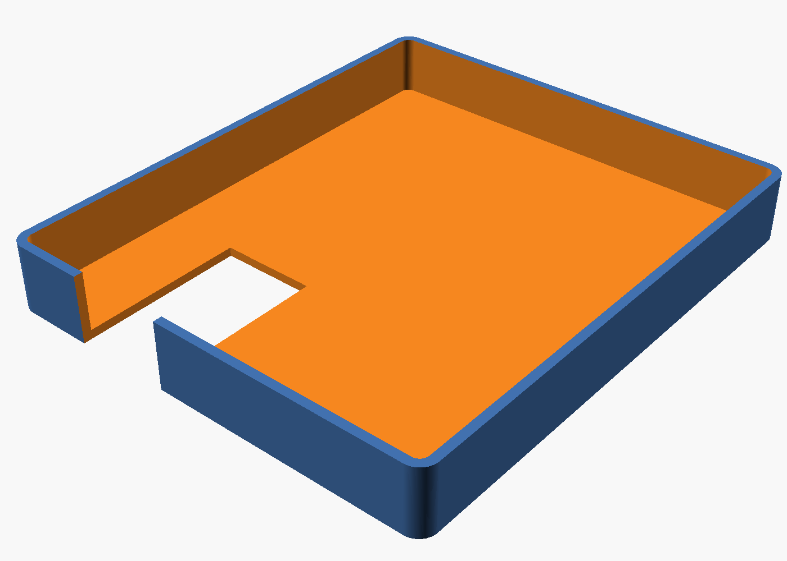

# Caterham 420R S3 — Transmission Tunnel Storage Tray

*A single-piece open tray that sits on the transmission tunnel, pushed forward
against the firewall, with a U-shaped notch to clear the wiring harness tube.*

Designed for a Caterham 420R S3 (narrow body). The tray attaches via Dual Lock
on the front wall (to the firewall) and non-abrasive grip tape on the underside
(no adhesive touches the leather tunnel cover).

| | |
| --- | --- |
| **Source** | [`tunnel_tray.scad`](tunnel_tray.scad) |
| **Dual Lock** | 3M Dual Lock™ SJ3550A 1"×8 ft — [Amazon](https://www.amazon.com/gp/product/B08R3BFZ27) |
| **Grip tape** | Cattongue Grips 2" non-abrasive grip tape — [Amazon](https://www.amazon.com/gp/product/B08DRLDBWT) |
| **Material** | ASA (preferred) or PETG — never PLA |
| **Print notes** | Print face-down (walls up). No supports needed. ≥4 walls, 25–30% infill. |

## Assembly

1. Stick a strip of Dual Lock along the front wall of the tray (23 mm tall face)
2. Stick the mating strip to the firewall at the same position
3. Cut a few pads of Cattongue grip tape and stick them to the underside of the tray floor
4. Press the tray onto the tunnel and slide forward — the Dual Lock mates and the grip tape bites the leather
