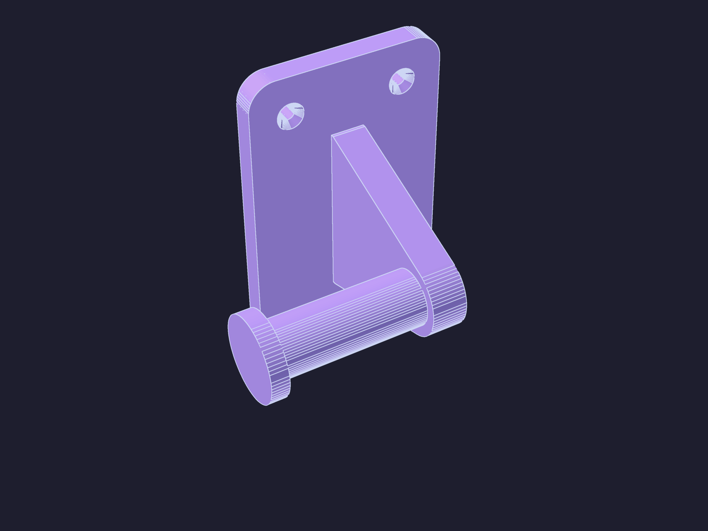

# Caterham Windscreen Hanger

*A wall bracket that stores a removed Caterham Seven windscreen by its steel
stanchions — no load ever touches the glass or frame. The screen hangs
**inverted** and flat to the wall; each stanchion sticks straight out and its
sideways-facing triangular cutout drops over a **peg**, and a larger-diameter
**collar** on the peg's end is the retention lip. Print two.*

Because the cutout faces perpendicular to the wall, the bracket reaches out and
makes a **90° turn** into the sideways peg. The part is one symmetric,
**non-handed** piece: print it twice and **flip one** for the opposite stanchion.
See [`../CONTEXT.md`](../CONTEXT.md) and
[ADR-0001](../docs/adr/0001-hang-windscreen-inverted-from-stanchion-cutouts.md)
for why it hangs this way.

| | |
| --- | --- |
| **Source** | [`windscreen_hanger.scad`](windscreen_hanger.scad) |
| **STL** | [`windscreen_hanger.stl`](windscreen_hanger.stl) |
| **Quantity** | Print **2** (flip one for the opposite stanchion) |
| **Mount** | 4 countersunk wall screws per bracket — land on a stud where one falls, toggle/butterfly anchors elsewhere |
| **Material** | PETG (resists creep under sustained load in a warm garage) |
| **Print notes** | **Wall plate flat on the bed, back (wall) face down** — a big 58 × 96 mm footprint that won't lift. The peg then prints horizontally ~49 mm up, so enable **supports under the peg/collar only**. 4+ walls, 30 %+ infill — it is structural. |

---

## Dimensions

| Dimension | Value |
|-----------|-------|
| Overall | 81 × 61 × 96 mm (W × D × H) |
| Wall plate | 58 × 96 mm, 7 mm thick, 8 mm corner radius |
| Peg | Ø16 mm; sticks 18 mm clear past the plate edge (stanchion slides fully on), then the collar |
| Collar (lip) | Ø24 mm × 5 mm, beyond the 18 mm seat |
| Peg standoff | collar's near rim stands 30 mm clear of the plate face (peg axis ~49 mm off the wall) |
| Fixing holes | 4 × countersunk — Ø4.5 mm shank, Ø9 mm head |

Every dimension is a top-level parameter in the SCAD. **Measure your own
stanchion** and tune `cutout`, `peg_d`, `peg_len`, `collar_d`, and `arm_reach`
before printing — the triangular cutout drives the peg fit, and the plate the
stanchion projects from sets `arm_reach`.

> **Fit first.** Print one bracket and offer it up to the actual stanchion cutout
> — confirm the cutout drops over the peg, hangs on steel only, and the collar
> holds — before printing the second and drilling the wall.

---

## License

CC BY-NC 4.0 — see [LICENSE](../LICENSE).
