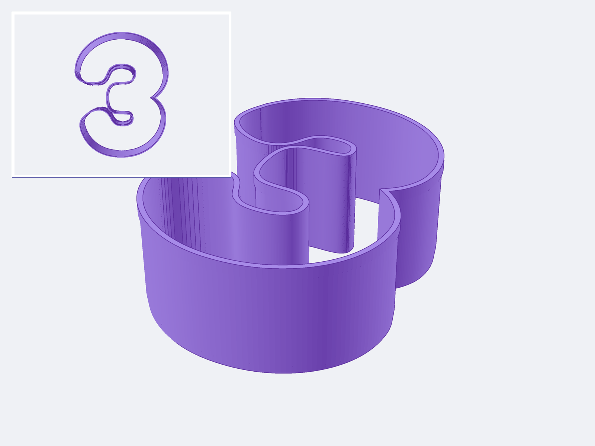

# Number 3 Cookie Cutter

*A one-piece cookie cutter that makes a 3.5-inch-tall number 3 in the rounded, playful Fredoka Bold typeface.*

The cutter has a top press rim, a three-nozzle-width body, and a tapered two-nozzle-width cutting edge.
The printable model is intentionally mirrored because the cutter flips over for use; the cookie reads as a normal number 3.
The Fredoka shape leaves substantial dough around the middle and bowls, but cookie strength still requires a baking test.

| | |
| --- | --- |
| **Source** | [`number_3_cookie_cutter.scad`](number_3_cookie_cutter.scad) |
| **Font outline** | [`fredoka_3.svg`](fredoka_3.svg) |
| **STL** | [`number_3_cookie_cutter.stl`](number_3_cookie_cutter.stl) |
| **Material** | PLA for the test print |
| **Quantity** | One |

---

## Dimensions

| Dimension | Value | Source |
| --- | ---: | --- |
| Cookie shape | 66.12 × 88.90 mm | User specified 3.5 in height; width follows Fredoka Bold |
| Cutter outside envelope | 69.32 × 92.10 × 31.75 mm | Computed from the revised model |
| Straight body wall | 1.20 mm | Three nominal 0.4 mm nozzle widths |
| Cutting edge | 0.80 mm | Two nominal 0.4 mm nozzle widths |
| Taper height | 4.00 mm | Design choice |
| Top press rim | 1.60 mm outward thickness × 3.20 mm height | Four nominal 0.4 mm nozzle widths; kept narrow so both curls stay clear |

The 88.90 mm value is the finished cookie shape.
The cutter is longer because its walls and press rim sit outside that shape.

The number outline comes from [Fredoka Bold](https://fonts.google.com/specimen/Fredoka), which is distributed under the SIL Open Font License 1.1.
The local SVG fixes the approved number shape so OpenSCAD does not require the font to be installed.

---

## Print settings

- Put the top press rim flat on the bed with the cutting edge upward.
- The 3 looks backward in this print orientation by design.
- Flip the cutter over for use so the cutting edge faces the dough and the resulting cookie reads normally.
- Use a 0.4 mm nozzle and 0.20 mm layer height.
- Use three walls, 0% infill, and no supports.
- Print one part.
- Confirm in the slicer that the 1.20 mm wall and 0.80 mm edge have continuous paths without gaps.

PLA is suitable for the first fit and cutting test.
Use filament and a printer setup that you accept for food contact.
FDM layer lines can retain residue, so wash the cutter carefully by hand and do not put ordinary PLA in a dishwasher.

---

## Adjustable parameters

The main parameters are together at the top of [`number_3_cookie_cutter.scad`](number_3_cookie_cutter.scad):

- `cookie_height` scales the Fredoka outline while preserving its proportions.
- `cutter_height` sets the complete depth from the press rim to the cutting edge.
- `body_wall` sets the straight wall thickness.
- `cutting_edge_wall`, `cutting_edge_height`, and `taper_steps` control the outline-preserving tapered edge.
- `press_rim_height` and `press_rim_outset` control the hand-contact rim.

The dough passage is open through the full height of the cutter.
At the dough-facing end, only the 0.80 mm cutting edge surrounds that open passage.
The press rim is at the opposite, hand-contact end of the cutter.

---

## Validation

OpenSCAD generated one simple printable object.
The exported STL measures 69.3229 × 92.1000 × 31.7500 mm and contains 32,792 triangles.
A topology check found one connected component, no boundary edges, and no edges with a non-manifold count.
The mesh has finite coordinates and a computed volume of 15,254.32 mm³.
The ten-step taper preserves every concave opening instead of taking a convex hull across the number.
A separate outline export measured 66.1218 × 88.9000 mm.

Software checks do not prove dough release, cutting performance, hand comfort, print rigidity, food suitability, or baked-cookie strength.
Verify those properties with the test print, a test cut, and a test bake.

---

## License

The model is licensed under CC BY-NC 4.0; see [LICENSE](../LICENSE).
Fredoka is available separately under the [SIL Open Font License 1.1](https://openfontlicense.org/).
