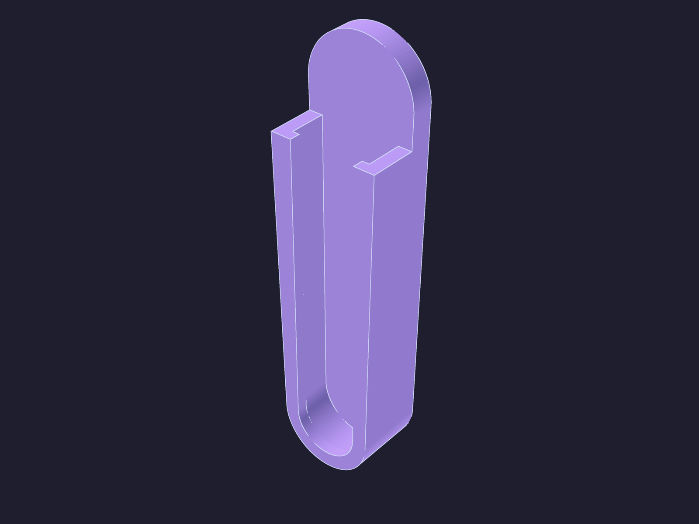

# Sponge Holder

*A slim SpongeButler-style holder: a rounded pill sticks flat to a wall or sink
backsplash with adhesive tape, and a U-grip on its front face holds a kitchen
sponge sticking straight out, perpendicular to the wall, so it air-dries.*

The sponge's edge drops into the U-grip from the top and wedges in by friction;
a small lip along the grip's front edge helps keep it from pulling out. No
hardware — just double-sided tape.

| | |
| --- | --- |
| **Source** | [`sponge_holder.scad`](sponge_holder.scad) |
| **STL** | [`sponge_holder.stl`](sponge_holder.stl) |
| **Mount** | Double-sided adhesive tape on the flat back |
| **Material** | PETG (moisture-tolerant) or PLA |
| **Print notes** | Pill back flat on the bed, U-grip pointing up. 3–4 walls, 20 % infill, no supports. |

---

## Dimensions

| Dimension | Value |
|-----------|-------|
| Overall | 30 × 116 × 19 mm (W × H × depth) |
| Pill plate | tapered — Ø30 top, Ø26 bottom, 6 mm thick |
| Grip slot | 22 mm wide (for a ~25 mm sponge — wedge fit) |
| Grip stand-off | 13 mm from the pill face |
| Retaining lip | 2 mm inward, along the grip's front edge |

The grip's rounded bottom is concentric with the pill's own bottom. Tune
`sponge_t`, `grip`, and the `r_top` / `r_bot` pill radii at the top of the SCAD
for a different sponge or a slimmer/fuller pill.

---

## License

CC BY-NC 4.0 — see [LICENSE](../LICENSE).
