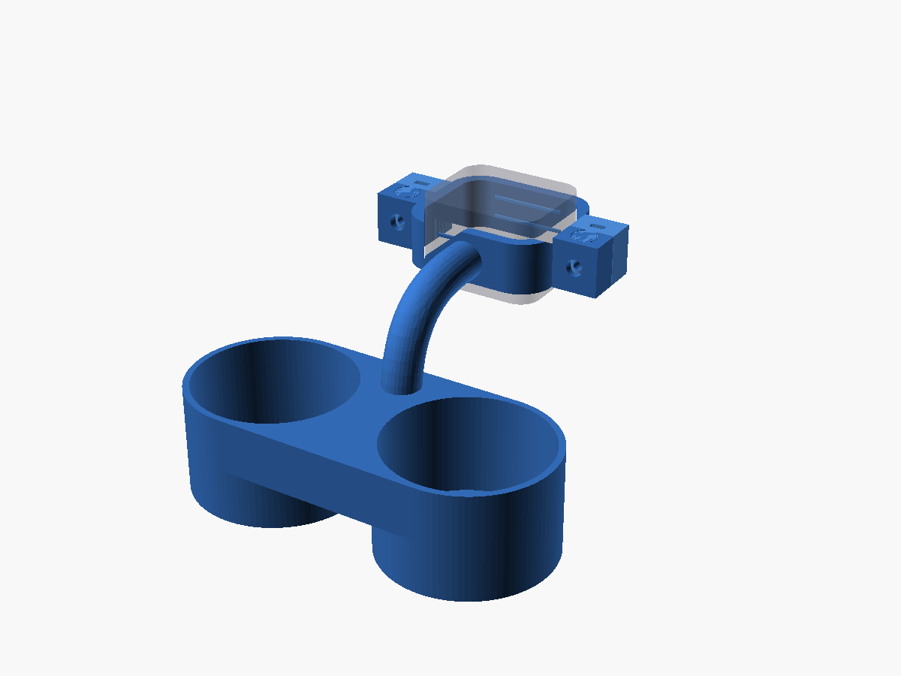

# Volvo Headrest Cupholder

*A two-piece clamshell that clamps the non-removable rear headrest neck and
carries two water bottles.*

The rear headrest support on modern Volvo XC seats doesn't pull out, and its
neck is a thick rounded-rectangle (58.75 × 50 mm), not a pair of thin rods.
This part wraps that neck in two halves that slide together with a
chess-pawn keyhole joint — locking front-to-back on their own — and are then
pinned by M4 bolts seated in captive nut traps. Internal grip ridges bite the
smooth plastic. A Ø22 mm gooseneck arm meets the clamp flat-faced and carries
a pill-shaped twin holder whose bore flares from Ø75 mm at the floor to Ø85 mm
at the rim, capturing the lower third of a tall bottle on a wide retaining
floor.

| | |
| --- | --- |
| **Source** | [`cupholder.scad`](cupholder.scad) |
| **STLs** | [`cupholder_back.stl`](cupholder_back.stl) · [`cupholder_front.stl`](cupholder_front.stl) |
| **Hardware** | 2× M4 nyloc nuts + 2× M4×20 bolts (pocket sized for a ~5 mm nyloc) |
| **Material** | ASA (preferred, for heat/creep) or PETG — never PLA |
| **Print notes** | ≥5 wall loops (perimeters), 40–50% sparse infill. Print the back half cups-up with supports under the arm/web. The Ø22 arm has ample margin, so layer orientation isn't critical — just don't stand the arm up vertically. |
